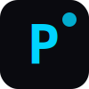

# Poke Labs — Brand Assets

Visual identity for Poke Labs.

## Contents

| File | Description |
|------|-------------|
| `logo.svg` | Square logo mark (P + dot) |
| `wordmark.svg` | "poke labs" wordmark |
| `colors.json` | Brand color palette |
| `typography.css` | Typography system |
| `og-banner.svg` | Social media / OG image |

## Colors

- **Primary**: `#00d4ff` (Cyan)
- **Background**: `#0a0a0f` (Near-black)
- **Text**: `#ffffff` (White)
- **Muted**: `#666666` (Gray)

## Typography

- **Headings**: JetBrains Mono (monospace, bold)
- **Body**: System UI / San Francisco
- **Code**: JetBrains Mono

## Usage

```html
<!-- Logo -->


<!-- Wordmark -->


<!-- OG Image -->
<meta property="og:image" content="og-banner.svg" />
```

## License

MIT · [Poke Labs](https://pokelabs.org)
